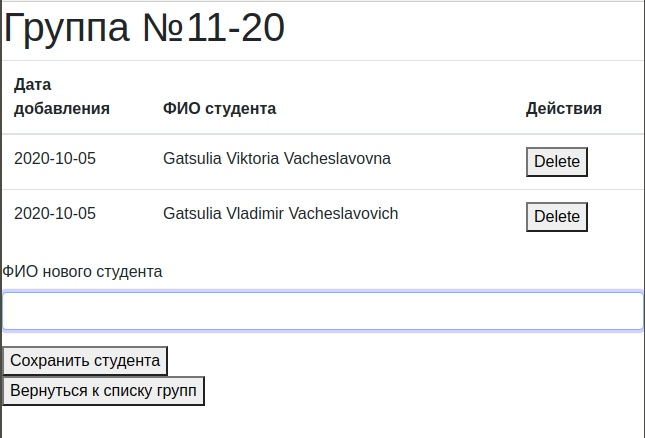

# База данных N-го университета

university_data_bases - это лёгкое web-приложение для работы с группами и студентами, имеющее следующий **функционал**:

**1. Страница со списком групп**           

````curl 'localhost:8080/'````                    
  
  ")

Добавление новой группы:
  * Ввести номер группы в соответствующем поле ввода и нажать кнопку ````Сохранить группу````              
  * С помощью curl запроса:        
  
        ````curl -H 'Content-Type:application/json' -d '{"num" : "51-60"}' 'localhost:8080/saveGroup'````        
        
Группы сортируются по дате добавления.

**2. Страница списка студентов группы:**

Перейти на страницу списка студентов группы:                    
  * Нажав на поле ````Edit```` в соответствующей строке                
  * С помощью curl запроса (в поле id указывается не номер группы, а её идентификатор, который можно посмотреть в разделе "Console" в вашем браузере):     
  
    ````curl 'localhost:8080/getGroupById/id=1'````               
    


Добавить студента в группу:                    
  * Ввести фамилию студента в соответствующем поле и нажать кнопку ````Сохранить студента````                
  * С помощью curl запроса (в поле id_group указывается не номер группы, а её идентификатор, который можно посмотреть в разделе "Console" в вашем браузере):     
  
    ````curl -H 'Content-Type:application/json' -d '{"fio" : "Viktoria Gatsulia"}' 'localhost:8080/addStudentsForGroup/id_group=1'````                
 
 Удалить студента из группы:                    
  * Нажав на кнопку ````Delet```` в соответствующей строке                
  * С помощью curl запроса (в поле id указывается идентификатор студента, который можно посмотреть в разделе "Console" в вашем браузере):     
  
    ````curl -X DELETE 'localhost:8080/deleteStudent/id=7'````        
    
Сортировка студентов по возрастанию ФИО.

Возвращение к списку групп:
  * Нажав на кнопку ````Вернуться к списку групп```` 
  * С помощью curl запроса:     
  
    ````curl 'localhost:8080/````     
    
## Используемые версии

* Ubuntu 18.04.4 LTS
* openjdk версии "1.8.0_162"
* Среда выполнения OpenJDK (сборка 1.8.0_162-8u162-b12-1-b12)
* 64-разрядная серверная виртуальная машина OpenJDK (сборка 25.162-b12, смешанный режим)
* mySQL 5.7
* Gradle 6.3
* curl 7.58.0 

## Процедура сборки и запуска

После установки всех необходимых приложений, необходимо:
1. Зайти в консоль mySQL из под root

    $ sudo mysql -u root
2. Создать пользователя БД

    $ CREATE USER 'user_name'@'localhost' IDENTIFIED BY 'password';
3. Чтобы назначить созданном пользователю неограниченные права доступа к базе данных, выполните следующую команду

    $ GRANT ALL PRIVILEGES ON * . * TO 'user_name'@'localhost';
4. Проверьте результат ещё раз войдя в mysql-консоль

    $ mysql -u user_name -p
5. Создайте новую БД

    $ CREATE DATABASES 'university'
    
**(не следует созадавать новую БД под root, т.к. в последних версиях mySQL для root пользователя используется не пароль а auth_socket)**  

Если вы всё делали по плану, то файл src/main/resources/application.yml нужно будет привести к следующему виду:

````
server:
  port: 8080
spring:
  thymeleaf:
    prefix: file:src/main/resources/templates/
    cache: false
  jpa:
    hibernate:
      ddl-auto: create
  datasource:
    url: jdbc:mysql://localhost:3306/university
    username: user_name
    password: password
    
````

7. Проект собирается с помощью команды gradle

    ````$ gradle build -x test````
8. Запуск проекта

    ````$ gradle bootRun````
    
 ### Тестирование

Для приложения были написаны тесты охватывающие как API так и сервис хранения.         

Сборка приложения вместе с тестами:
````gradle build````

Запуск тестов:
````gradle test````

Также был проведён эксперемент, по добавлению в группу 1024 студентов, который завершился успешно. Повторить его можно запустив скрипт test.sh, находящийся в корневом каталоге       

````chmod +x test.sh````

````./test.sh````
